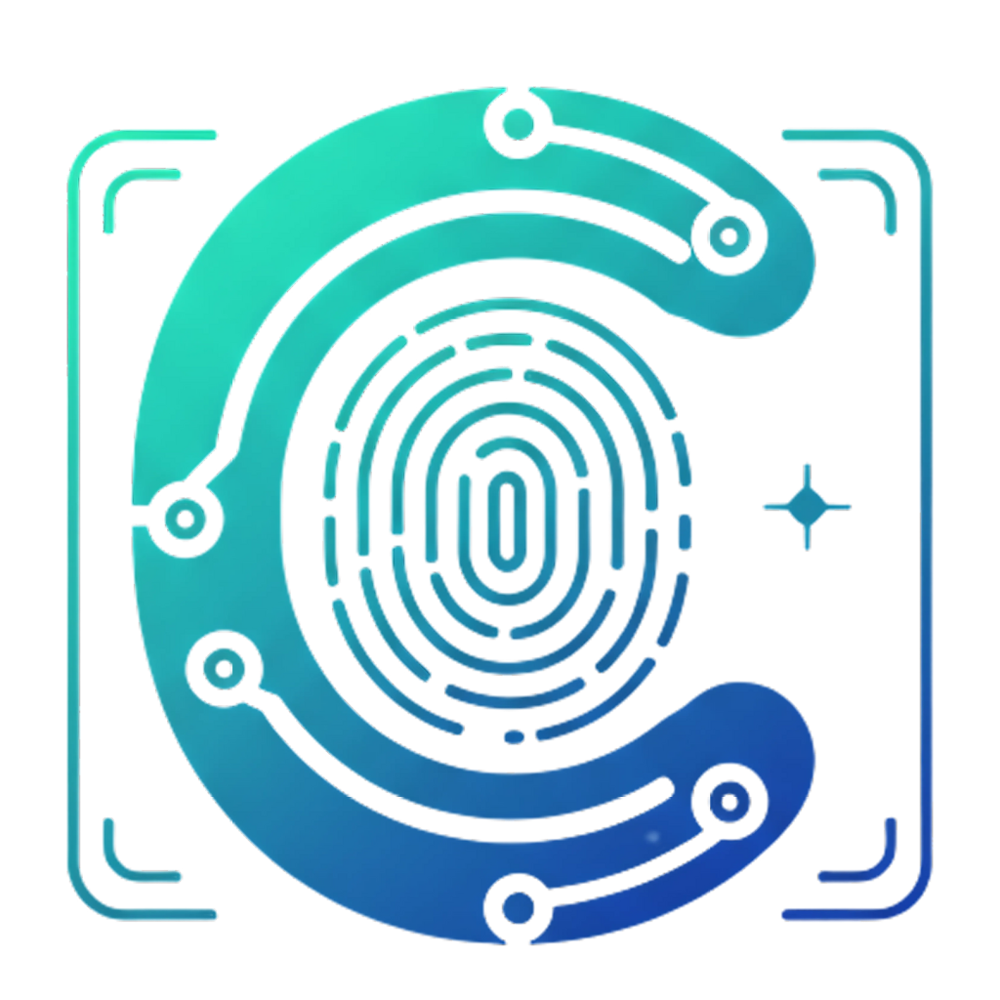

# Custophi 🔒✨

**Two Powerful Tools, One Platform**  
_Custophi combines cutting-edge password security with AI-powered personal branding to give you complete control over your digital identity._

[](https://reactjs.org/)
[](https://tailwindcss.com/)
[](https://www.netlify.com/)
[](https://custophi.netlify.app/)
[](LICENSE)
[]
[]
---

## 🌟 Project Overview

**Custophi** combines cutting-edge security with AI-driven creativity to empower your digital identity:
- **Secret Key**: Military-grade password generator with client-side encryption  
- **Bio Scripto**: GPT-4 powered AI bio generator with cultural localization  
- **Privacy-First Philosophy**: Zero data retention, GDPR compliant, end-to-end encryption

---
    
## 🌐 Live Experience  
**Immerse Yourself in Digital Sovereignty**  

Experience Custophi in action by exploring the live demo of the web app.
See how our tools for password security and AI-powered personal branding work seamlessly together:

[](https://custophi.netlify.app/)  

Feel free to try out the features and discover how Custophi can enhance your digital identity.

<div style="margin-top: 2rem">
  
  
</div>

---

## 🛠️ Tech Stack

- **Frontend**: [React.js](https://reactjs.org/) (v18.x) + [Tailwind CSS](https://tailwindcss.com/) (v3.x) ⚛️🎨  
- **AI Engine**: DeepSeek via [OpenRouter](https://openrouter.ai/) 🧠  
- **Version Control**: [Git](https://git-scm.com/) & [GitHub](https://github.com/) 🗂️  
- **Deployment**: [Netlify](https://www.netlify.com/) ☁️  
- **Package Manager**: [npm](https://www.npmjs.com/)  
- **Build Tool**: [Vite](https://vitejs.dev/) (if applicable, otherwise remove)  
- **Testing**: (Add testing frameworks here if used, e.g., Jest, React Testing Library)  
- **CI/CD**: (Add CI/CD tools here if used, e.g., GitHub Actions, CircleCI)

---

## 🌟 Featured Tools

| Secret Key 🔐 | Bio Scripto 🤖 |
|--------------|----------------|
| Military-grade password generator | GPT-4 powered bio creator |
| Client-side encryption | 25+ cultural adaptations |
| Real-time strength analysis | Platform-optimized formatting |
| Zero-knowledge architecture | Emotionally intelligent phrasing |

---

### 📁 Project Structure

```
Custophi Web/
├── public/
│   ├── index.html
│   └── images/
│       └── Custophi.png
├── src/
│   ├── components/
│   │   ├── Footer.js
│   │   └── Navbar.js
│   ├── pages/
│   │   ├── About.js
│   │   ├── BioScripto.js
│   │   ├── BlogBio.js
│   │   ├── BlogSecret.js
│   │   ├── ContactUs.js
│   │   ├── Home.js
│   │   ├── SecretKey.js
│   │   ├── PrivacyPolicy.js
│   │   └── ScrollToTop.js
│   ├── App.js
│   ├── index.css
│   └── index.js
├── .gitignore
├── package.json
├── package-lock.json
├── postcss.config.js
├── tailwind.config.js
└── README.md
```

---

## 🚀 Getting Started

Follow these steps to run the Custophi Web app locally:

### 1. Clone the Repository

```bash
git clone https://github.com/zied-mb/Custophi.git
cd Custophi
```

### 2. Install Dependencies

Make sure you have Node.js and npm installed. Then run:

```bash
npm install
```

### 3. Run the Development Server

Start the app locally with:

```bash
npm start
```

This will launch the app at [http://localhost:3000](http://localhost:3000) in your browser.

---

## 🤝 Contributing

Contributions are welcome! If you'd like to contribute to Custophi, please follow these steps:

1. Fork the repository.
2. Create a new branch for your feature or bugfix.
3. Make your changes and commit them with clear messages.
4. Push your branch to your fork.
5. Open a pull request describing your changes.

Please ensure your code follows the existing style and includes appropriate tests.

---

## ❓ FAQ

**Q: Is my data stored on any server?**  
A: No, Custophi uses a zero-knowledge architecture. Your data never leaves your browser.

**Q: Which platforms are supported by Bio Scripto?**  
A: Bio Scripto supports Instagram, LinkedIn, TikTok, and more with platform-specific formatting.

**Q: How secure is the Secret Key password generator?**  
A: It uses military-grade encryption and client-side generation to ensure maximum security.

---

## ⚠️ Known Issues

- Some browsers may have limited support for client-side encryption features.
- Occasional delays in AI bio generation under high load.
- Password strength meter may not reflect all edge cases.

--- 

# Brand Identity ✨  
*Where Customer Wisdom Meets Digital Innovation*

---

<table>
  <tr>
    <td width="35%" style="border:none">
      
    </td>
    <td style="border:none; vertical-align:top">

## The Philosophy of Σοφία  
**Etymology**: *Custophi* = **Customer** + **Sophia** (σοφία)  
*Ancient Greek concept of "wisdom through strategic understanding"*

> "True digital sovereignty emerges when technical excellence harmonizes with human insight."  
> ― Custophi Design Principle

### 🔑 Core Tenets  
<div style="column-count:2; column-gap:2rem">
  
- 🧠 **Wisdom-Led Design**  
  Data-informed decision architecture  
- 🤝 **Relational Engineering**  
  Empathy-driven customer ecosystems  
- 🔄 **Sustainable Innovation**  
  Growth-focused technical evolution  
- 🛡️ **Human-Centered Security**  
  Privacy as fundamental right  
</div>
  </tr>
</table>

---

## 📬 Contact

For questions, support, or feedback, please reach out via:

- LinkedIn: [Zied Meddeb](https://www.linkedin.com/in/zied-meddeb-7087a2266/)
- Email: Dounzay@gmail.com
